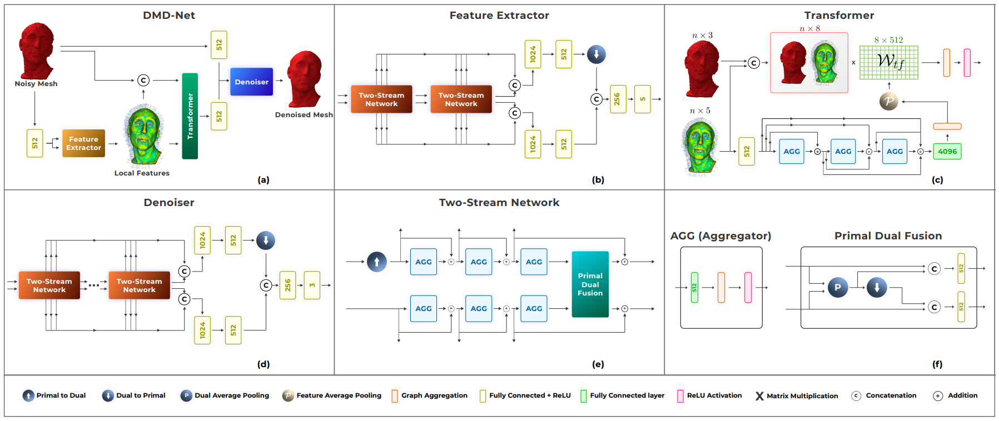

# DMD-Net: Deep Mesh Denoising Network

This repository contains a personal implementation inspired by the DMD_Net paper:
[DMD-Net: Deep Mesh Denoising Network](https://arxiv.org/abs/2506.22850). The code here is written independently, based solely on my understanding of the ideas describled in the paper. 


# Dataset
- [] ShapeNet Dataset(Waiting admin receive)
- [] ModelNet40(Writing)

## How test and train

## Requirements
```bash
pip install -r requirements.txt
```

## Train
```bash
python train.py 
```

### Results

## Inference

# DMD-Net: Deep Mesh Denoising Network
*Aalok Gangopadhyay, Shashikant Verma, Shanmuganathan Raman*
[Paper](https://arxiv.org/abs/2506.22850)

```bibtex
@inproceedings{gangopadhyay2022dmd,
  title={Dmd-net: deep mesh denoising network},
  author={Gangopadhyay, Aalok and Verma, Shashikant and Raman, Shanmuganathan},
  booktitle={2022 26th International Conference on Pattern Recognition (ICPR)},
  pages={3168--3175},
  year={2022},
  organization={IEEE}
}
```